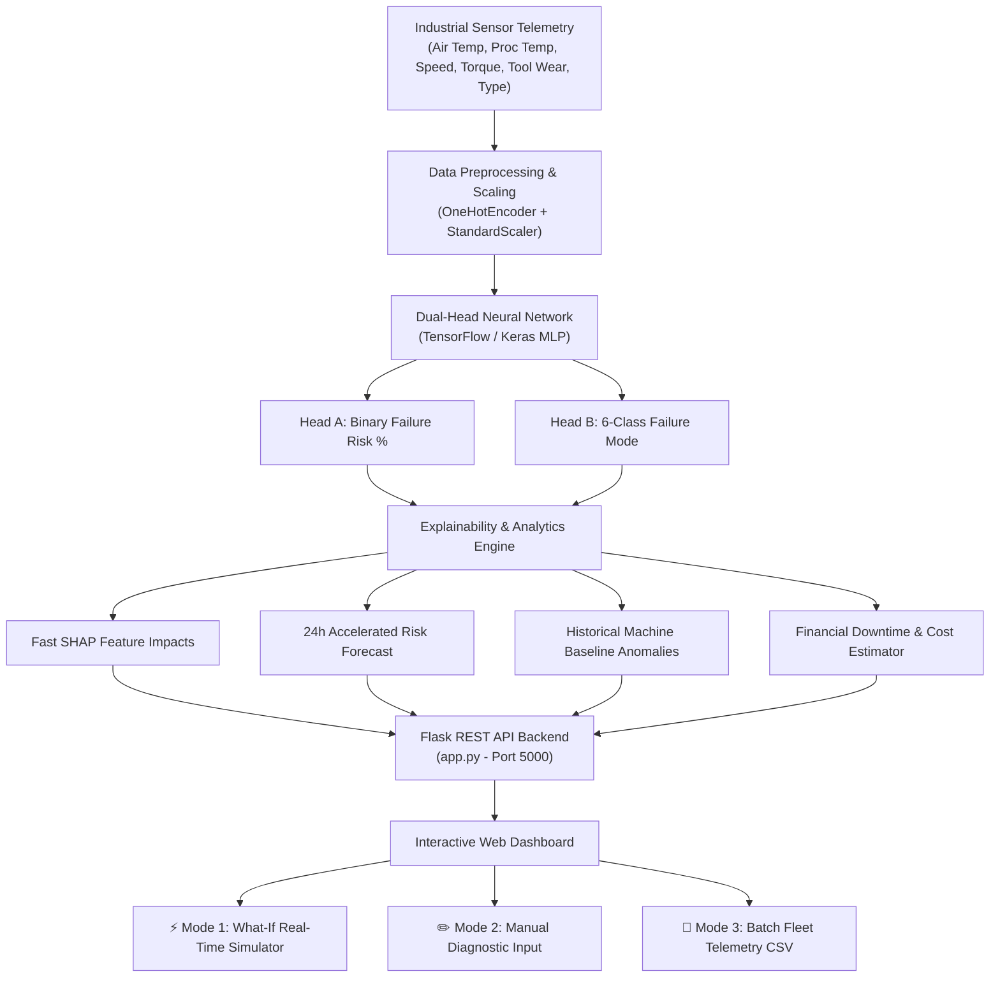

# 🛠️ Comprehensive Project Walkthrough: Industrial Predictive Maintenance Dashboard

> **AI4I 2020 Machine Health & Explainable Neural Telemetry System**

---

## 1. Executive Summary & Purpose

The **Industrial Predictive Maintenance Dashboard** is an end-to-end industrial machine health monitoring and diagnostic system built on the **AI4I 2020 Predictive Maintenance Dataset**. 

In high-throughput manufacturing environments, equipment downtime leads to severe financial losses, while unexpected catastrophic failures cause costly hardware damage and safety hazards. This application solves both challenges by combining **deep learning predictive modeling**, **explainable AI (SHAP)**, **self-baseline anomaly detection**, and **real-time interactive simulation**.

---

## 2. Full System Architecture



---

## 3. Technology Stack

| Layer | Technologies Used | Description |
| :--- | :--- | :--- |
| **Machine Learning Core** | Python 3.10, TensorFlow / Keras, Scikit-Learn | Dual-Head Multi-Layer Perceptron (MLP) trained on 10,000 industrial data points |
| **Imbalance Strategy** | Imbalanced-Learn (SMOTE) | Synthetic Oversampling to handle rare failure instances (~3.39% base rate) |
| **Explainable AI (XAI)** | SHAP (KernelExplainer & Sensitivity Perturbation) | Quantifies exact contribution (+/- %) of each sensor feature to failure risk |
| **Web Server / REST API** | Flask 3.0, Flask-CORS | Handles single predictions, SHAP calculations, CSV uploads, & ticket exports |
| **Frontend UI / UX** | HTML5, Vanilla CSS Design System, ES6 Javascript | Glassmorphic design with Chart.js line, bar, and doughnut charts |

---

## 4. Machine Learning Pipeline & Training Workflow

### A. Dataset Overview (AI4I 2020)
The dataset contains 10,000 telemetry readings with 5 numeric sensors and 1 machine quality variant:
1. **Type**: Quality Variant (`L` = Low/High-volume 60%, `M` = Medium 30%, `H` = High/Heavy-duty 10%)
2. **Air Temperature [K]**: Ambient operational temperature (Nominal ~300 K)
3. **Process Temperature [K]**: Machine working temperature (Nominal ~310 K)
4. **Rotational Speed [rpm]**: Spindle rotation speed (Safe: 1200 to 1800 rpm)
5. **Torque [Nm]**: Motor torque output (Safe: 15 to 55 Nm)
6. **Tool Wear [min]**: Accumulated tool usage time (Safety limit: 200 min)

### B. Derived 6-Class Failure Labeling
The pipeline creates a unified 6-class target variable (`failure_type`):
- **0 - No Failure**: Nominal health.
- **1 - Tool Wear Failure (TWF)**: Tool wear exceeds replacement threshold (200 to 240 min).
- **2 - Heat Dissipation Failure (HDF)**: Temperature difference `(Process Temp - Air Temp) < 8.6 K` and `Rotational Speed < 1380 rpm`.
- **3 - Power Failure (PWF)**: Operational Power `(Torque * Speed)` out of bounds (`< 3500 W` or `> 9000 W`).
- **4 - Overstrain Failure (OSF)**: `Tool Wear * Torque` exceeds machine strain threshold.
- **5 - Random Failure (RNF)**: Random noise failure (0.1% baseline).

### C. Imbalance Mitigation via SMOTE
Because actual failures occur in only 339 of 10,000 records (~3.39%), standard training leads to high false negative rates. 
- **Solution**: SMOTE (Synthetic Minority Over-sampling Technique) resamples the minority failure classes in the training set (`k_neighbors=3`), balancing class representations before feeding into the neural network.

### D. Dual-Head Neural Network Architecture
```
Input Vector (8 inputs: 3 One-Hot Encoded Types + 5 Scaled Numerics)
   │
   ├── Dense(64, ReLU) ──> Dropout(0.2)
   │
   ├── Dense(32, ReLU) ──> Dropout(0.2)
   │
   ├─── Head A: Dense(1, Sigmoid)  ──> Binary Failure Risk (0.0 to 1.0)
   │
   └─── Head B: Dense(6, Softmax)  ──> Failure Mode Distribution (6 classes)
```

- **Loss Function**: `Total Loss = Binary Crossentropy (Head A) + Categorical Crossentropy (Head B)`
- **Evaluation Result**: Achieved **ROC-AUC of 0.963** on held-out test dataset.

---

## 5. Key System Features & Algorithms

### 1. Fast SHAP Explainability Engine
Rather than presenting black-box predictions, the system computes feature risk perturbations relative to a nominal baseline (Air Temp = 298 K, Process Temp = 308 K, Rotational Speed = 1500 rpm, Torque = 40 Nm, Tool Wear = 100 min):

`Risk Impact = Failure Probability (Current Feature) - Failure Probability (Baseline)`

This displays a dynamic horizontal bar chart highlighting whether high Torque, high Tool Wear, or thermal overload pushed the risk score up or down.

### 2. Live 24-Hour Risk Forecast Curve
Computes accelerated wear compounding over a 24-hour horizon based on current mechanical stress factor:

`Stress Factor = (Torque / 40.0) * (Rotational Speed / 1500.0) * (Process Temp / 308.0)`

Visualized as a smooth Chart.js area chart with dynamic color gradients (Green to Amber to Red).

### 3. Historical Machine Self-Baseline Anomaly Detection
Compares current sensor readings against historical variant averages (`L`, `M`, or `H` variant). If any parameter strays beyond warning threshold percentages (15% or higher for Torque/Speed, 1.5 K or higher for Temperature), warning/critical flags are injected directly above the diagnostic text.

### 4. Financial Downtime & Loss Estimator
Calculates projected downtime hours and repair costs using machine-specific hourly rates:
- **Variant L**: $650 per hour
- **Variant M**: $1,400 per hour
- **Variant H**: $3,200 per hour

---

## 6. User Interface & Mode Design

The web interface features 3 distinct operational modes with tailored visual themes:

### ⚡ Mode 1: What-If Real-Time Simulator
- **Design Aesthetic**: Electric Blue border top glow, `Live Syncing` pulse badge.
- **Controls**: Dual range sliders + numeric display pills.
- **Interactivity**: Automatic 80ms debounced live API syncing as sliders move. Submit button is hidden.

### ✏️ Mode 2: Manual Equipment Diagnostic Input
- **Design Aesthetic**: Warm Amber & Slate engineering workstation theme, `Manual Entry` badge.
- **Controls**: Synchronized numeric input text fields side-by-side with range sliders.
- **Interactivity**: Auto-sync is paused so engineers can input precise measurements. Includes a prominent **"Run Diagnostic Prediction"** action button.

### 📁 Mode 3: Batch Fleet Telemetry CSV Ingestion
- **Design Aesthetic**: Fleet control room view with Drag-and-Drop file dropzone.
- **Features**: Analyzes hundreds of machines simultaneously, displays Fleet Risk Rankings sorted highest risk first, provides an inspect button to load any machine into the What-If simulator, and exports full fleet CSV reports.

---

## 7. Project File Structure

```
mini project/
├── app.py                   # Flask REST API backend & prediction server
├── train_model.py           # Machine learning training & export pipeline
├── requirements.txt         # Dependencies list (Flask, TensorFlow, Sklearn, etc.)
├── PROJECT_WALKTHROUGH.md   # System walkthrough documentation (Downloadable)
├── data/
│   └── ai4i2020.csv         # AI4I 2020 Predictive Maintenance Dataset
├── model/
│   ├── model.keras          # Saved Dual-Head Keras MLP Neural Network
│   ├── scaler.pkl           # Fitted StandardScaler object
│   ├── ohe.pkl              # Fitted OneHotEncoder object
│   ├── shap_explainer.pkl   # Serialized SHAP background explainer
│   └── meta.json            # Dataset feature metadata & ROC-AUC score
├── static/
│   ├── css/
│   │   └── style.css        # Vanilla CSS Design System & UI styles
│   └── js/
│       └── main.js          # Chart.js rendering, mode tabs, & API handlers
└── templates/
    └── index.html           # HTML5 Dashboard Template
```

---

## 8. How to Download & Run the Application

### Option A: Direct Download via Web Dashboard
1. Open the live application at [http://localhost:5000](http://localhost:5000)
2. Click the **"Download Walkthrough"** button located in the top navigation bar.
3. Or access the direct download link at [http://localhost:5000/api/download_walkthrough](http://localhost:5000/api/download_walkthrough).

### Option B: Run Locally from Terminal
1. **Install Dependencies**:
   ```bash
   pip install -r requirements.txt
   ```

2. **Run Server**:
   ```bash
   python3 app.py
   ```

3. **Access Application**:
   Navigate to `http://localhost:5000` in your web browser.
